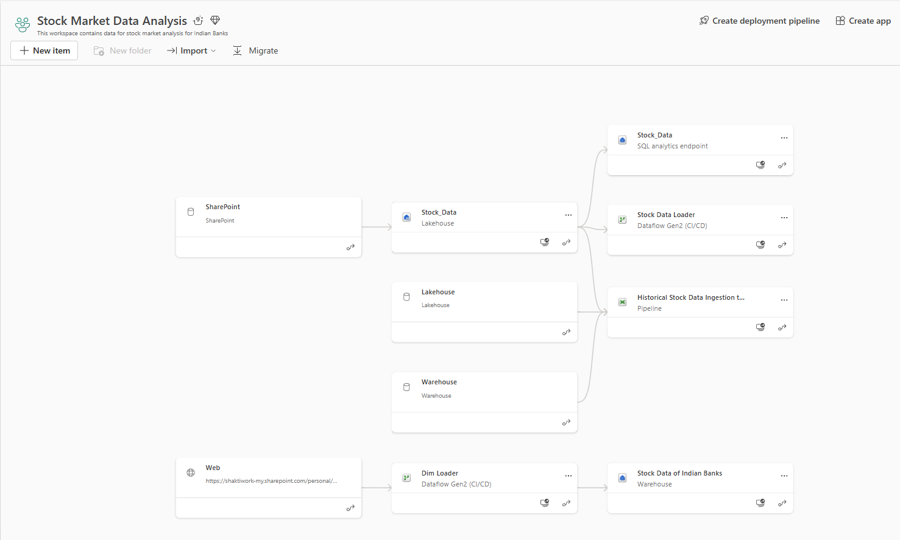
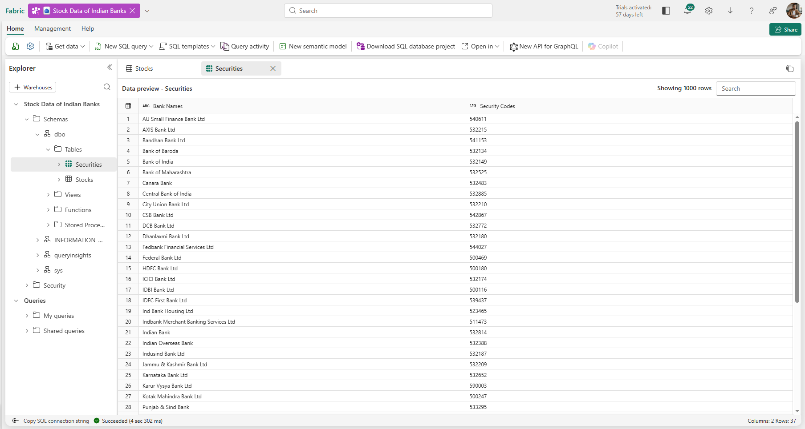
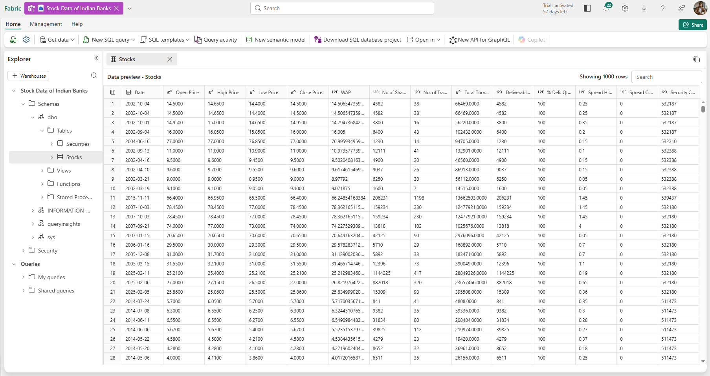
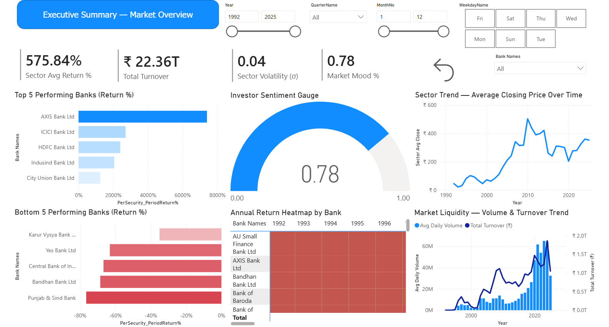
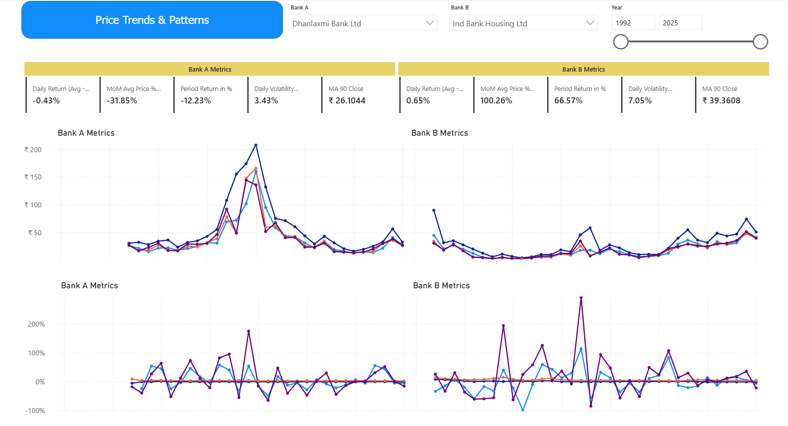
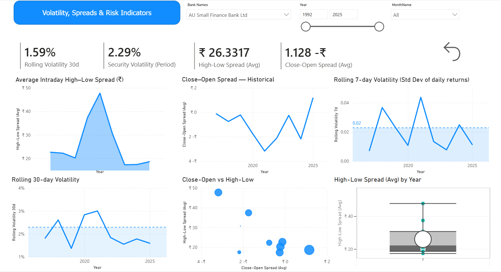

# ⭐ **Stock Market Analysis for Indian Banks — Fabric + Power BI Admin Project**

### *Enterprise-grade Analytics Architecture | Microsoft Fabric | Power BI Governance | End-to-End Data Engineering & Reporting*

---

# 📌 **1. Project Overview**

This project demonstrates a full **Power BI Admin + Microsoft Fabric** implementation using real stock market data for major Indian banks. The solution covers:

* **Automated data extraction** using JavaScript scrapers
* **Raw CSV ingestion** via SharePoint / OneDrive
* **Microsoft Fabric Lakehouse architecture**
* **Dataflow Gen2 transformations**
* **Medallion-style modeling (Bronze → Silver → Gold)**
* **Warehouse creation with SQL Project (sqlproj)**
* **Optimized semantic model (model.json)**
* **Enterprise-grade Power BI Report**
* **Security, performance, and deployment considerations**

---

## 📌 **Source of Stock Market Data**
> Link to Source- [BSE India t+1 settlement](https://www.bseindia.com/markets/equity/EQReports/StockPrcHistori.html?flag=0)

## 📌 **Live Report**
> Link to Report- [Stock Market Analysis of Indian Banks](https://app.powerbi.com/view?r=eyJrIjoiOWM0ZGFlZmQtYjIyOC00OGFkLTk2MTgtMjE5M2NmM2YxODUxIiwidCI6IjVmOGI3NGFkLWJkOGUtNDA4MC1iZGM2LTkyMDg0OTdhMjNmNCJ9)

# 📌 **2. Architecture Diagram (Lineage View)**

> 📷 **Lineage View** 
> 

### **Architecture Summary**

| Layer                   | Component                            | Purpose                                           |
| ----------------------- | ------------------------------------ | ------------------------------------------------- |
| **Data Source**         | BSE India website (JS scraper)       | Extract daily OHLCV data for each bank            |
| **Landing Zone**        | OneDrive/SharePoint CSV folder       | Stores flattened CSV files per security code      |
| **Bronze Layer**        | Fabric Lakehouse (Files)             | Raw ingestion of flat files                       |
| **Silver Layer**        | Dataflow Gen2                        | Cleans, transforms, normalizes stock datasets     |
| **Gold Layer**          | Fabric Warehouse                     | Business-ready relational tables used by Power BI |
| **Semantic Layer**      | Power BI Dataset (model.json)        | Measures, relationships, model optimizations      |
| **Visualization Layer** | Power BI Report                      | Market intelligence & investor insights           |
| **Admin Layer**         | Governance, Monitoring, Optimization | Power BI Admin responsibilities                   |

---

# 📌 **3. Data Sources**

## **3.1 JavaScript Scrapers (Automated Download System)**

This repo includes:

* `code optimized.js`
* `paste.js`
* Security list inside automated download code:

```javascript
lists = "540611,532215,541153,532134,532149,532525,..."
await executeDownload(lists, 0, 800);
```


These scripts were executed inside the BSE India browser console to download historical daily stock data automatically.

**Output:**
One CSV per bank, named by **Security Code**, containing daily OHLCV data from **1992–2025**.

---

## **3.2 Flat File Storage (SharePoint / OneDrive)**


Each CSV contains:

| Column          | Description               |
| --------------- | ------------------------- |
| Date            | Trading day               |
| Open Price      | First traded price        |
| High Price      | Highest price of the day  |
| Low Price       | Lowest price of the day   |
| Close Price     | Final traded price        |
| WAP             | Weighted average price    |
| No.of Shares    | Volume traded             |
| No.of Trades    | Total trades              |
| Total Turnover  | Liquidity measure         |
| Deliverable Qty | Investor holding behavior |
| % Deliverable   | Delivery ratio            |

---

# 📌 **4. Fabric Lakehouse (Bronze Layer)**

> 

After adding the Onedrive folder as a shortcut, CSV files are accessible directly in Fabric through the **Files** section of the Lakehouse.

---

# 📌 **5. Dataflow Gen2 (Silver Layer)**

Data cleaning & transformation tasks performed:

* Parse dates and enforce data types
* Remove null rows & outliers
* Normalize column names
* Add derived fields (daily return, spreads)
* Append all CSVs into a unified **Stocks** table
* Map Security Codes → Bank Names via **Securities** dimension
* Handle missing trading days through `DateTable`

> Dataflow gen 2 template- [template](Dataflow_gen_2_template/Historical_Stock_market_data_loader_template.pqt)

Dataflow output automatically lands in the **Warehouse** gold layer.

---

# 📌 **6. Fabric Warehouse (Gold Layer)**

> 

* `Preview_of_Securities_table`


* `Preview_of_stocks_table`


This Warehouse represents your **enterprise data mart**.

### Tables:

### **dbo.Securities**

| Column         | Description         |
| -------------- | ------------------- |
| Bank Names     | Name of Indian bank |
| Security Codes | Code from BSE India |

### **dbo.Stocks**

| Column                    | Description                      |
| ------------------------- | -------------------------------- |
| Date                      | Trading day                      |
| Open / High / Low / Close | Market prices                    |
| WAP                       | Weighted average price           |
| No.of Shares              | Trading volume                   |
| No.of Trades              | # of trades                      |
| Total Turnover            | Rupee turnover                   |
| Deliverable Qty           | # of shares delivered            |
| % Deliverable             | long-term holding characteristic |
| Spread Open-Close         | Spread Open-Close values         |
| Spread H-L                | Spread High-Low values           |
| Security Code             | Foreign key to Securities table  |

**Included in repo:**

* Full Warehouse SQL project (sqlproj)
* Schema definitions

> Link to the [Warehouse files](Warehouse_files)

---

# 📌 **7. Semantic Model (model.json)**

The semantic model defines:

* Star schema
* Relationships
* All DAX measures
* Formatting rules
* Calculation groups *(optional)*
* Folder structure for KPIs, returns, volatility, spreads, risk, liquidity

Model also contains optimized measures such as:

* `Sector Avg Return %`
* `Sector Volatility (σ)`
* `Market Mood %`
* `Rolling Volatility (7d, 30d)`
* `Bank-to-bank comparisons`

Model follows **Power BI Admin performance best practices**:

* Avoid row-level calculated columns when measures suffice
* Use aggregation where applicable
* Reduce cardinality by formatting dates
* Hide technical columns
* Folder grouping of measures (clean model)

---

# 📌 **8. Power BI Report**

A fully interactive investor analytics report with admin-grade optimization.


---

# 🟦 **PAGE 1 — Executive Summary / Market Overview**

> 

### Purpose:

High-level KPIs summarizing sector performance, liquidity, momentum, and sentiment.

### Visuals:

* KPI cards: Avg Return %, Volatility, Total Turnover, Market Mood
* Top gainers / losers
* Sector trend line
* Return heatmap
* Sentiment gauge
* Liquidity chart

### Business Questions Answered:

* What is the overall market health?
* Which banks are outperforming?
* What is investor sentiment today?
* How liquid is the banking sector?

---

# 🟦 **PAGE 2 — Price Trends & Patterns**

> 

### Purpose:

Visualize price patterns, seasonality, and multi-bank comparisons.

### Visuals:

* Multi-bank price trend
* Sparkline grid (bank-wise trends)
* Monthly seasonality chart
* Two-bank comparison panel

### Questions Answered:

* How have bank prices evolved over time?
* Which banks show strong seasonality?
* How do two banks compare head-to-head?

---

# 🟦 **PAGE 3 — Volatility, Spreads & Risk Indicators**

> 

### Purpose:

Risk analytics for investors & risk teams.

### Visuals:

* High–Low spread area
* Close–Open spread line
* Rolling 7d / 30d volatility
* Risk Score per bank
* Box plot of daily returns (Fed from the `Daily Return Raw` column)

### Questions Answered:

* Which banks are most volatile?
* What is the intraday risk profile?
* Which banks have consistently wide spreads?
* How does overall sector risk evolve?


---

# 📌 **9. Power BI Admin Practices Implemented**

### ✔ Data Governance

* Fact and dimension tables with surrogate keys
* Column-level security (if applicable)
* Data classification tags
* Ownership and workspace role separation

### ✔ Performance Optimization

* Auto Date disabled
* Model size reduction
* Incremental Refresh (ideal for daily stock tables)
* Pre-aggregation of volatility and return metrics
* Dataflow Gen2 for upstream compute
* Lakehouse shortcuts to avoid data duplication

### ✔ Reliability & Monitoring

* Warehouse lineage view
* Refresh history tracking
* SQL Analytics endpoint query monitoring

### ✔ Deployment & Automation

* SQL Warehouse exported as **sqlproj**
* Dataflow Gen2 exported as **pqt template**
* Model exported via **model.json**
* CI/CD-ready architecture

---


### **Skills Demonstrated:**

#### ✔ End-to-end data solution design

From data ingestion → transformation → modeling → reporting.

#### ✔ Architecture implementation in Fabric

Lakehouse → Dataflow Gen2 → Warehouse → Power BI → Governance.

#### ✔ Expertise in data modeling & DAX

Measures for return, volatility, spreads, risk analytics.

#### ✔ Performance tuning

Aggregation, refresh strategy, efficient model design.

#### ✔ Data governance

Lineage, documentation, role-based access, workspace management.

#### ✔ Documentation & communication

Readable README with screenshots demonstrating admin competency.

#### ✔ BI solution storytelling

Each page answers a business question with visual clarity.

This README positions you as a **Power BI Admin / Fabric Engineer** capable of managing production-grade BI workloads.

---

# 📌 **11. Repo Structure**

```
/
├── README.md
├── /Dataflow_gen_2_template            #contains pqt template
├── /Images                             #contains image files
├── /Js codes for Data Collection       #contains js codes
│   ├── code optimized.js
│   ├── paste.js
├── /Power BI report                    #contains pbix file
├── /Semantic Model                     #semantic model                    
└── Warehouse_files                     #Sqlproj and schema
```

---

# 📌 **12. Conclusion**

This project demonstrates a complete enterprise-grade data pipeline and analytics solution using **Microsoft Fabric + Power BI**, showcasing capabilities in:

* Data architecture
* BI engineering
* Power BI administration
* Governance and optimization
* Reporting and storytelling


---
